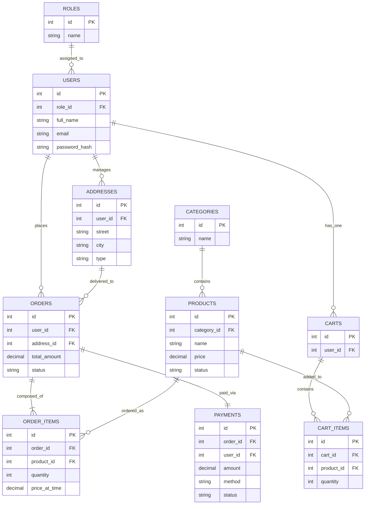

# D-FOOD Ordering System - Project Report

## 1. System Overview

**D-FOOD** is a comprehensive food ordering and delivery management system designed for the Tanzanian market. It connects customers with a curated menu of food items, allowing for seamless ordering, secure payments, and reliable delivery tracking.

### Key Features

-   **User Management**: Role-based access control (Admin, Customer).
-   **Product Catalog**: Categorized menu with search, filtering, and image support.
-   **Shopping Cart**: Real-time cart management with dynamic pricing.
-   **Checkout Flow**: Address selection, payment method choice (Cash, Card, Mobile Money), and order placement.
-   **Order Management**: Order tracking for customers and status updates for admins.
-   **Admin Panel**: Dashboard for managing products, categories, users, and viewing sales reports.
-   **Responsive Design**: Fully responsive frontend for desktop and mobile devices.

### Technology Stack

-   **Backend**: PHP 8.x (Native, MVC Architecture)
-   **Database**: MySQL 8.0 (Normalized to 3NF)
-   **Frontend**: Vanilla JavaScript (ES6+), HTML5, CSS3
-   **Authentication**: JWT (JSON Web Tokens)
-   **Server**: Apache (XAMPP Environment)

---

## 2. Database Design

The database schema is designed to be robust, normalized, and scalable.

### Entity-Relationship Diagram (ERD)

### Table Descriptions

1.  **Users**: Stores customer and admin accounts. Linked to `roles`.
2.  **Products**: Menu items with pricing, description, and image. Linked to `categories`.
3.  **Addresses**: Delivery addresses for users.
4.  **Carts & CartItems**: Persistent shopping cart for users before checkout.
5.  **Orders**: Finalized transactions with status (pending, preparing, delivering, completed).
6.  **OrderItems**: Snapshot of products in an order (preserves price at time of purchase).
7.  **Payments**: Records financial transactions linked to orders.

---

## 3. API Documentation

The backend exposes a RESTful API. All responses are in JSON format.

### Base URL
`http://localhost/food-ordering-system/backend/api` (Development)

### Key Endpoints

#### Authentication
-   `POST /auth/login` - Authenticate user and get JWT.
-   `POST /auth/register` - Register new customer account.

#### Products (Public)
-   `GET /products` - List all products.
-   `GET /products/{id}` - Get product details.
-   `GET /categories` - List categories.

#### Cart (Auth Required)
-   `GET /cart` - View current cart.
-   `POST /cart/add` - Add item to cart.
-   `DELETE /cart/remove` - Remove item.

#### Orders (Auth Required)
-   `POST /orders` - Place a new order with address and payment method.
-   `GET /orders/user` - Get order history.

#### Admin (Admin Role Required)
-   `POST /products` - Create new product.
-   `PATCH /orders/{id}/status` - Update order status.
-   `GET /reports/sales` - View sales reports.

---

## 4. Setup Instructions

1.  **Prerequisites**: XAMPP (Apache + MySQL), VS Code.
2.  **Database Setup**:
    -   Open phpMyAdmin (`http://localhost/phpmyadmin`).
    -   Create database `food_ordering_system`.
    -   Import `database/schema.sql`.
3.  **Configuration**:
    -   Verify `backend/config/database.php` matches your MySQL credentials.
    -   Set `JWT_SECRET_KEY` in `backend/utils/jwt.php` (already configured).
4.  **Running**:
    -   Start Apache and MySQL in XAMPP.
    -   Access the frontend at `http://localhost/food-ordering-system/frontend/index.html`.
